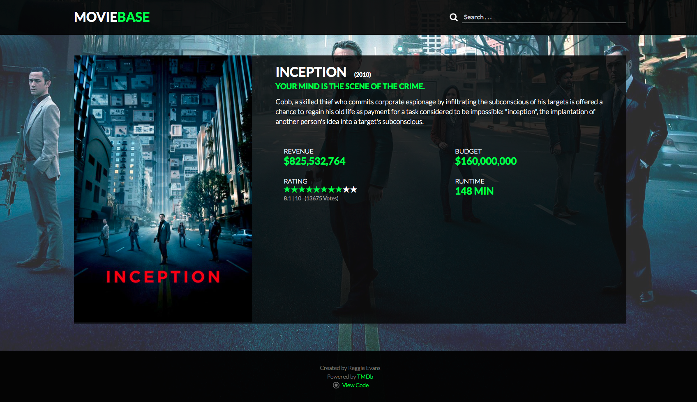

# MovieBase

MovieBase is a Movie Database clone powered by The Movie Database API. The project was built using create-react-app.

## Screenshot


## Learning

This app was built in an effort to become more familiar with ReactJS

## ToDo

* Still need to work on the mobile styling
* Would like to make the images on the home page cleaner and links to thier specific pages

## Built With

* [React](https://github.com/facebookincubator/create-react-app) - Front-End web application framework

## Installation
```
git clone https://github.com/ReggEvans/movie-database-react.git
cd movie-database-react
npm install
npm start

open localhost:3000 in the browser

* Project Requires an API key from The Movie Database
```

## License
This project is licensed under the MIT License.
